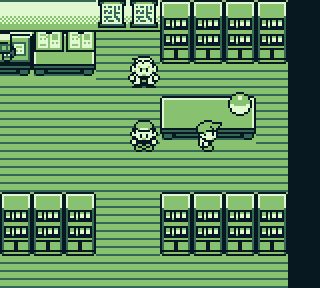
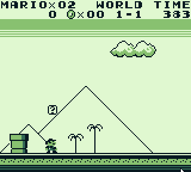
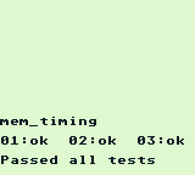

# **boy***ish*    
Gameboy Emulator written in JavaScript  
  
## Features    
* Passes blarggs memory-timing tests  
* Passes cpu_instrs and instr_timing tests  
* Passes dmg-acid2  
* Semi-accurate-*ish* PPU emulation  
* MBC1 and MBC3 Memory Bank Controller support  
* Runs Pokemon Gen1/2 games  
* Automatic Game saves  
* Modular-*ish* structure 
* Basic audio emulation 

## Screenshots  
| **Pokemon Red**  | **Super Mario Land**  |
| :---: | :---: |
| **Gejmbåj**  | **Deez Nutz**    |
| **mem_timing**  | |

**owo**
